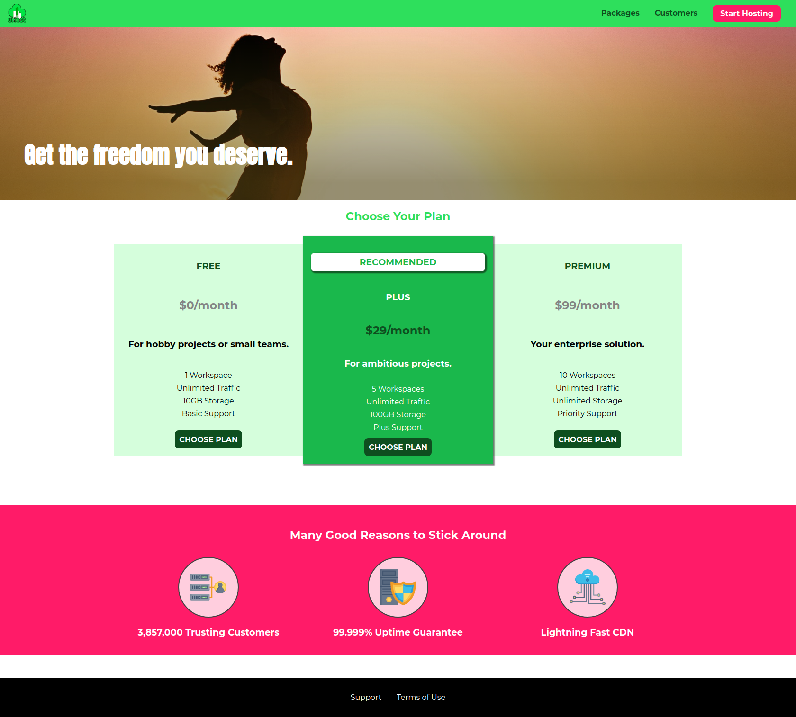

# uHost

> In this project, I will build a website for a fictional hosting company. The main goal of this project is to facilitate my learning as I study the most important concepts in CSS.

## Built With

- JavaScript, HTML & CSS

## Live Demo

[Live Demo Link](https://trekab.github.io/uHost/)

## Getting Started

You can download the zipped file of the project, extract it, and simply double-click the `index.html` file in the root folder in order to have it open in your default browser. You can alternatively just click the `Live Demo Link` above to view the project.

## Authors

👤 **Treasure Kabareebe**

- Github: [@trekab](https://github.com/trekab)
- Twitter: [@TKabareebe](https://twitter.com/TKabareebe)
- Linkedin: [Treasure Kabareebe](https://www.linkedin.com/in/treasure-kabareebe/)

## 🤝 Contributing

Contributions, issues and feature requests are welcome!

Feel free to check the [issues page](issues/).

## Show your support

Give a ⭐️ if you like this project!

## Acknowledgments

- [Udemy - CSS - The Complete Guide (incl. Flexbox, Grid & Sass)](https://www.udemy.com/course/css-the-complete-guide-incl-flexbox-grid-sass/)

## 📝 License

This project is [MIT](lic.url) licensed.
